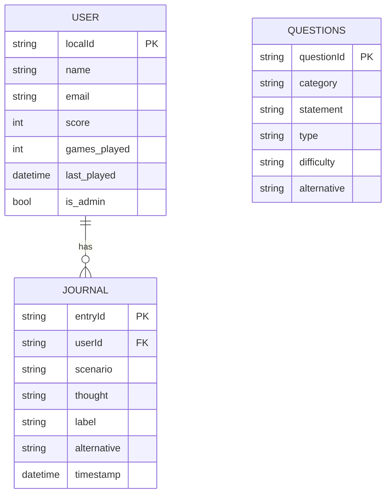
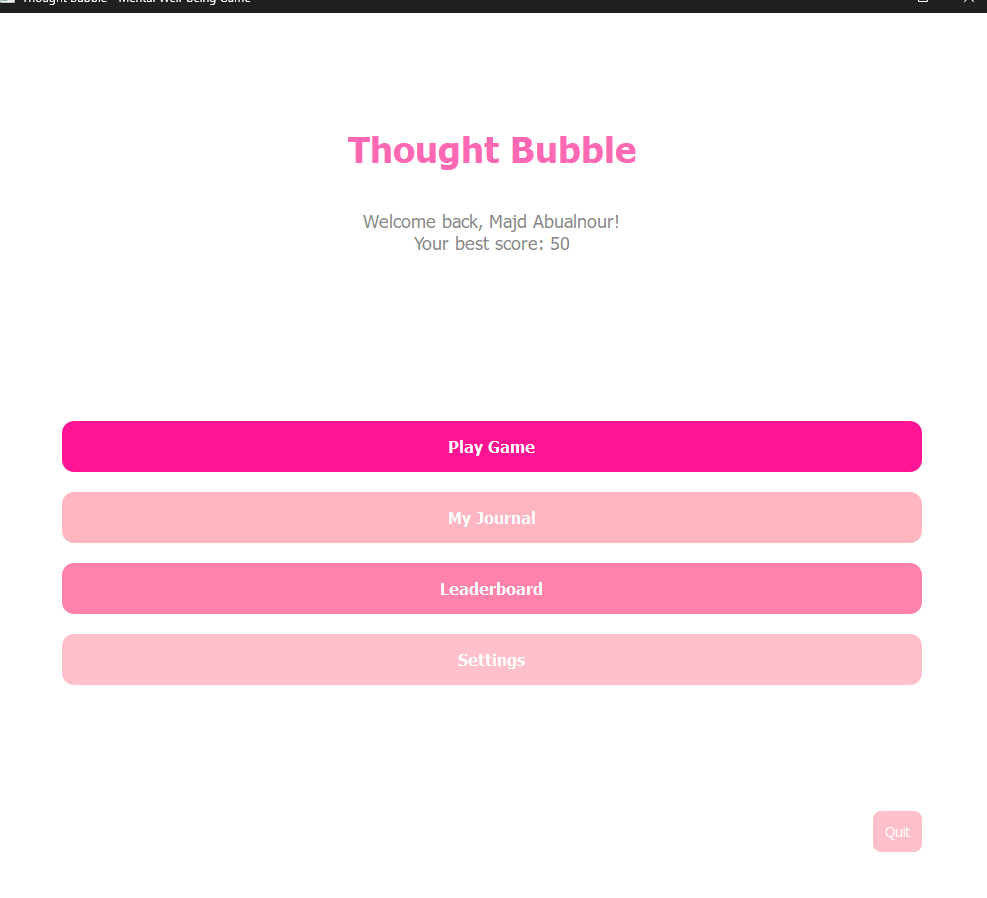
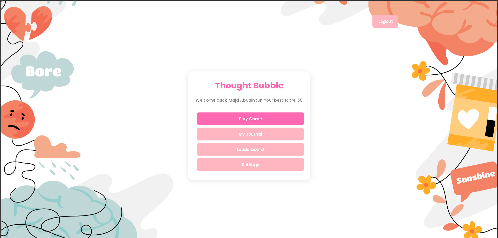

# Thought Bubble - Mindful Thinking Game 🧠💭

 <!-- Replace with your actual logo path -->

**Cultivate mindful thinking through an engaging cognitive behavioral therapy game**

[](LICENSE)
[](https://www.python.org/downloads/)
[](https://pypi.org/project/PyQt6/)
[](https://firebase.google.com/)
[](https://github.com/yourusername/thought-bubble/actions)
[](https://codecov.io/gh/yourusername/thought-bubble)

## 🌟 Features

- **Cognitive Behavioral Therapy Exercises**: Practice identifying and restructuring negative thoughts
- **Multi-Platform Support**: Available as web, mobile (Kivy), and desktop (PyQt6) applications
- **Gamified Learning**: Earn points and streaks for correct classifications
- **Personal Journal**: Track your progress and reflect on your thoughts
- **Admin Dashboard**: Manage questions and view analytics (for professionals)
- **Firebase Backend**: Secure cloud storage for user data and questions

## 📦 Installation

### Desktop Version (PyQt6)
```bash
# Clone the repository
git clone https://github.com/yourusername/thought-bubble.git
cd thought-bubble

# Create and activate virtual environment (recommended)
python -m venv venv
source venv/bin/activate  # On Windows use `venv\Scripts\activate`

# Install dependencies
pip install -r requirements.txt

# Run the application
python main.py
```

### Web Version
```bash
# The web version is a single HTML file - just open it in a browser!
open web/index.html
```

### Mobile Version (Kivy)
```bash
cd mobile
pip install -r requirements.txt
python main.py
```

## 🛠️ Tech Stack

| Component           | Technology                          |
|---------------------|-------------------------------------|
| **Frontend (Desktop)** | PyQt6, QML                          |
| **Frontend (Web)**    | HTML5, CSS3, JavaScript, Firebase   |
| **Frontend (Mobile)** | Kivy, KivyMD                        |
| **Backend**          | Firebase Realtime Database          |
| **Authentication**   | Firebase Authentication             |
| **Build Tools**      | PyInstaller, Buildozer (for mobile) |

## 📊 Data Model



## 📱 Screenshots

| Desktop Version | Mobile Version | Web Version |
|-----------------|----------------|-------------|
|  |  |  |

## 🚀 Deployment

### Firebase Setup
1. Create a Firebase project at [firebase.google.com](https://firebase.google.com/)
2. Enable Authentication (Email/Password) and Realtime Database
3. Add your web app to get configuration details
4. Update the Firebase config in:
   - `web/index.html` (for web version)
   - `config/firebase_config.json` (for desktop/mobile)

### Desktop Build
```bash
pyinstaller --onefile --windowed --icon=assets/icons/app.ico main.py
```

### Android Build
```bash
buildozer android debug deploy run
```

## 📈 Roadmap

- [x] Core CBT exercise functionality
- [x] Multi-platform support
- [x] Firebase integration
- [ ] Mood tracking and analytics
- [ ] Daily challenges and reminders
- [ ] Multi-language support
- [ ] Therapist dashboard

## 🤝 Contributing

We welcome contributions! Please follow these steps:

1. Fork the repository
2. Create your feature branch (`git checkout -b feature/AmazingFeature`)
3. Commit your changes (`git commit -m 'Add some AmazingFeature'`)
4. Push to the branch (`git push origin feature/AmazingFeature`)
5. Open a Pull Request

Please read [CONTRIBUTING.md](CONTRIBUTING.md) for details on our code of conduct.

## 📜 License

This project is licensed under the MIT License - see the [LICENSE](LICENSE) file for details.

## ✉️ Contact

Project Maintainer - [Your Name](mailto:your.email@example.com)

Website - [https://thoughtbubble.example.com](https://thoughtbubble.example.com)

## 🙏 Acknowledgments

- Inspired by cognitive behavioral therapy techniques
- Thanks to all open source contributors
- Special thanks to our beta testers

---

<p align="center">
  <em>"Change your thoughts and you change your world."</em> — Norman Vincent Peale
</p>
